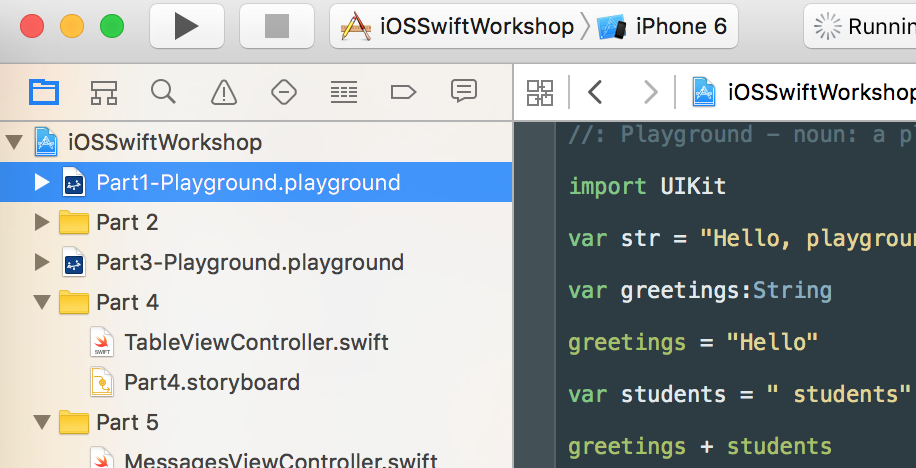
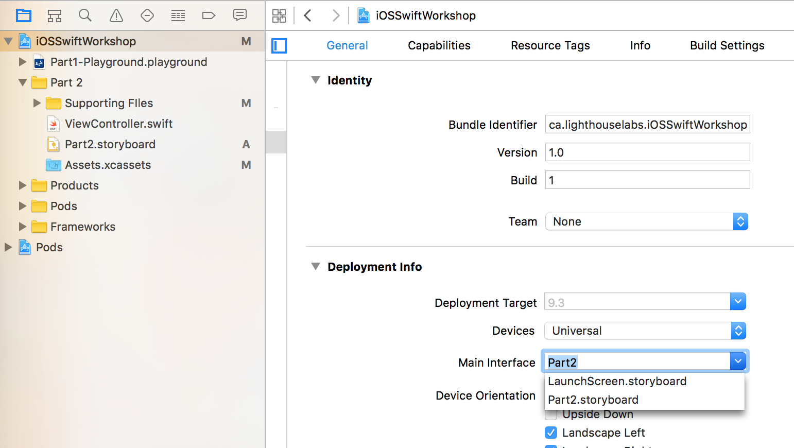

## Part 1

Download the Zip

- UnZip the folder
- Then double-click and open up the "iOSSwiftWorkshop.xcworkspace" file.

Go to Part1-Playground.playground  

Complete the questions in the playground

## Part 2

You will now be working with files in the Part 2 folder.  

To the Part2.storyboard file and perform the following on the View Controller scene:  

- Add an ImageView into your screen  
- Add a Button into your screen  
- Connect up the ImageView (control + drag) to code
- Connect up the Button to code
- Add an image to the Assets.xassets folder  
- Add a UIImage property inside your code for the button Action 
- Set your imageView.image to be that image

#### Bonus Challenges:  
- Change the text on the Button to say "Show Image" (Use storyboard)  
- Change the color of the Button to Red (Use storyboard)  

## Part 3

Go to Part3-Playground.playground  

Complete the questions in the playground

## Part 4

You will now be working with files in the Part 4 folder.  

Also, to make your app load the storyboard for Part 4, Switch the main interface to Part 4's storyboard. 

To the TableViewController.swift file:  

- Make an array of 5 Strings  
- Change tableView's method for numberOfRowsInSection to return 5  
- Add to tableView's method for cellForRowAtIndexPath to get the appropriate string based on what indexPath the row in the table should display  
- Se the cell.textLabel's text to be the approriate string  

#### Bonus Challenge:
- Set the cell.imageView's image to be the image you added to the project  

## Part 5

You will now be working with files in the Part 5 folder.  

Also, to make your app load the storyboard for Part 5, Switch the main interface to Part 5's storyboard. 

 

To the AddMessageViewController.swift file:  

- Add a Textfield to get your username  
- Add a Textfield to get the message text  
- Save the message by setting a username and a text.
- Check that your message appears in the Table when you run the app!!

#### Bonus Challenge:
- Add an ImageView to your Screen. 
- Set the image to be the image you added to the project
- Save the image when you save the message (an UIImage can be converted to an NSData, which can be converted to a PFFile, which can be saved)
